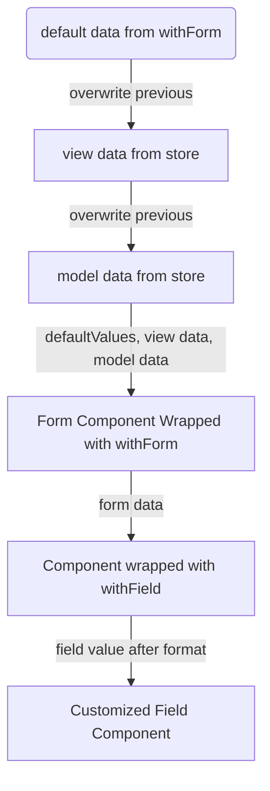
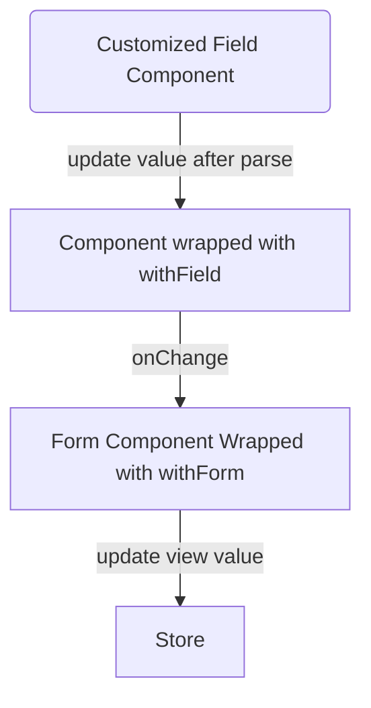
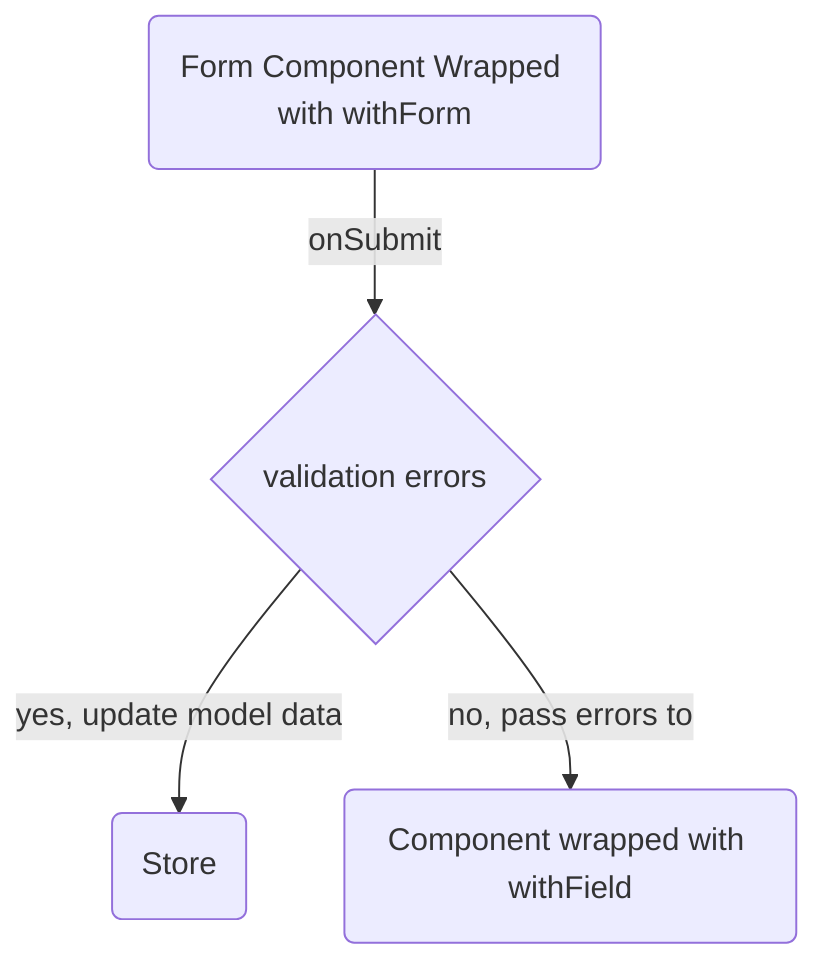

# redux-mini-form

[](https://travis-ci.org/eavesal/redux-mini-form)

`redux-mini-form` is a minimal form solution that supply basic form operations and works with `React` and `Redux`.

### Installation

```bash
npm install --save redux-mini-form
```

## Examples

* [Simple Form](https://github.com/eavesal/redux-mini-form/tree/master/examples/simple)
* [Submit Validation Form](https://github.com/eavesal/redux-mini-form/tree/master/examples/submit-validation)
* [Sync Validation Form](https://github.com/eavesal/redux-mini-form/tree/master/examples/sync-validation)
* [Wizard Form](https://github.com/eavesal/redux-mini-form/tree/master/examples/wizard-form)

## Overview

The basic concept for `redux-mini-form` is simple. We use a HOC `withForm` to do CURD operations to redux store and supply some CURD method in React context. And also we use `withField` to consume the context and supply necessary method to field component.

#### Data Flow When Display



#### Data Flow When Update View Values



#### Data Flow When Update View Values

